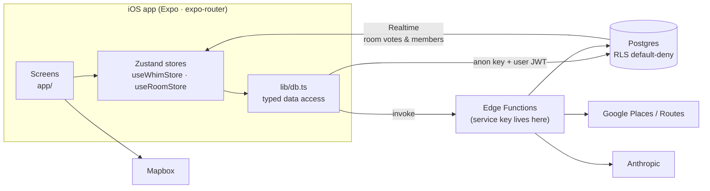

<div align="center">


# BeWhim

**Swipe. Save. Go.**

A travel-discovery app for iOS — *Tinder for places to go.*
Swipe through hand-picked spots for a city and a mood, keep the ones you love,
and BeWhim turns them into a day you can actually walk. Plan solo, or swipe
together with friends and let your mutual likes become the plan.


</div>

---

## Contents

- [What it does](#what-it-does)
- [Features](#features)
- [Coverage](#coverage)
- [Tech stack](#tech-stack)
- [Architecture](#architecture)
- [Repository layout](#repository-layout)
- [Getting started](#getting-started)
- [Backend](#backend)
- [Security model](#security-model)
- [Design system — "Field Notes"](#design-system--field-notes)
- [Releasing](#releasing)
- [Roadmap](#roadmap)
- [Further reading](#further-reading)

---

## What it does

```
  Discover ──► Swipe ──► Save ──► Route ──► Share
  city+vibe    right =    Hitlist   hours-smart   community feed
               keep       + micro-  day plan on   or a story card
                          stops     a map
```

1. **Discover** — pick a city and a *vibe*. BeWhim deals a curated deck of spots for that mood.
2. **Swipe** — right to keep, left to pass. Undo a mistake; super-save a sure thing.
3. **Save** — kept spots land on your **Hitlist**, with optional nearby micro-stops (coffee, viewpoints) attached.
4. **Route** — the Hitlist is sequenced into morning / daytime / evening blocks by opening hours, then walked nearest-neighbour, with transit legs between stops.
5. **Share** — publish the trip to the community, or export a card to your stories.

## Features

**Discovery**
- **Four vibes per city** — The Classics · Matcha · Nature · After Dark
- **Seasonal collections** — 13 editorial decks; in-season ones lead automatically
- **Near me** — live GPS discovery of real places around you, sorted into vibes
- **Add your spots** — paste your own favourites; an LLM pass sorts them into the right vibe

**The swipe deck**
- Gesture-driven deck (Reanimated + Gesture Handler) with haptics, undo and super-save
- **Micro-discovery** — attach nearby detours to an anchor spot
- Real place photos with a stock fallback, so a card is never blank

**Planning**
- **Hitlist** scoped per city + vibe — collections never bleed across contexts
- **Smart Route** — hours-aware ordering, Mapbox route map, transit legs, hand-off to Maps
- **Build a trip** from scratch for any city; trip reminders

**Social**
- **Rooms** — create a room, share a 6-character code or `whim://room/join?code=…` link; everyone swipes the same deck and spots *everyone* likes become live matches over Realtime ("It's a match ✦"), then a group day plan
- **Community feed** — published trips and spots from other travellers, plus Editors' Picks
- **Friends** with @handles and public profiles
- **Moderation** — report / block / leave across rooms and community content

**Passport**
- **Verified check-ins** — stamping requires GPS proximity (~250 m); only verified stamps count toward public stats
- **City badges** — Bronze / Silver / Gold at 1 / 3 / 5 check-ins
- Shareable passport card ("Strava flex")

**Platform**
- Email sign-in (Sign in with Apple wired, pending enablement), Keychain-backed sessions, in-app password reset and account deletion
- Offline-friendly: Hitlist, Passport and profile work without a connection
- Push notifications, self-hosted analytics and crash logging with an in-app admin dashboard

## Coverage

**48 cities · 24 countries · ~2,160 curated spots · 4 vibes per city** (build 11)

| Region | Cities |
| --- | --- |
| **Japan** | Tokyo, Kyoto, Osaka, Fukuoka, Hiroshima |
| **United States** | New York, San Francisco |
| **UK & Ireland** | London, Edinburgh, Glasgow, Manchester, Dublin |
| **France** | Paris, Nice, Lyon, Marseille |
| **Germany** | Berlin, Munich, Hamburg, Frankfurt, Hannover, Darmstadt |
| **Italy** | Rome, Milan, Florence, Venice, Naples |
| **Iberia** | Barcelona, Madrid, Seville, Valencia, Lisbon, Porto |
| **Central Europe** | Vienna, Prague, Budapest, Zurich, Geneva, Warsaw, Krakow |
| **Benelux** | Amsterdam, Brussels |
| **Nordics** | Copenhagen, Stockholm, Oslo, Helsinki, Reykjavik |
| **Greece** | Athens |

**Coming in the next build — +15 cities (63 total, ~2,770 spots):** Bruges, Antwerp,
Rotterdam, Split, Zagreb, Bologna, Turin, Gothenburg, Bordeaux, Malaga, Bilbao, Cologne,
Tallinn, Ljubljana, Bratislava. Already seeded in the database; they appear in the
picker once the next build ships.

New cities are seeded server-side with the `seed-city` Edge Function (Google Places
search per vibe plus a review-grounded LLM curation pass). They go live in the database
immediately, but only appear in the city picker once a build ships the updated
`whim-mobile/data/cities.ts`.

## Tech stack

| Layer | Choice |
| --- | --- |
| App framework | **Expo SDK 52**, React Native 0.76 (New Architecture, Hermes), React 18, TypeScript |
| Navigation | **expo-router v4** — file-based routing |
| Styling | **NativeWind v4** (Tailwind for RN) |
| State | **Zustand** (optimistic, background-persisted) + TanStack Query for caching |
| Animation | Reanimated 3 + Gesture Handler |
| Maps | **Mapbox** via `@rnmapbox/maps` |
| Backend | **Supabase** — Postgres with row-level security, Auth, Edge Functions (Deno), Realtime, Storage |
| Places & transit | Google Places + Google Routes, called only from Edge Functions |
| AI curation | Anthropic Claude — vibe-sorting user spots and curating seeded cities, server-side |
| Native | expo-location, expo-notifications, expo-apple-authentication, expo-secure-store, expo-haptics, expo-sharing + react-native-view-shot |

## Architecture



- **One store owns the user loop.** `useWhimStore` updates optimistically for a snappy UI, persists to Supabase in the background, toasts on failure, and reconciles on the next `hydrate()`.
- **The client never passes `user_id`.** RLS scopes every read and write to the signed-in user.
- **Anything billed or privileged runs server-side.** Edge Functions validate input, enforce per-user daily caps on billed cache-misses, and are the only place secrets exist.
- **`SwipeDeck` is presentational** (props in, `onSwipe` out) and is shared by the solo deck and the group deck.
- **Route sequencing is pure.** `lib/route.ts` (`orderSmart()`) buckets spots by opening hours and walks each block nearest-neighbour — no framework dependencies.

**Navigation model:** five tab roots (Discover, Hitlist, Route, Community, Passport)
render the glass tab bar and no back button; everything else (swipe, rooms, trips,
settings, …) is a pushed screen with the shared `BackButton`.

## Repository layout

```
whim-app/
├── whim-mobile/                 # ← the Expo app (run every command from here)
│   ├── app/                     # expo-router screens
│   │   ├── (tabs)/              #   Discover · Hitlist · Route · Community · Passport
│   │   ├── room/                #   group rooms: hub, join, lobby, swipe, plan
│   │   ├── trip/[id].tsx        #   published trip
│   │   ├── u/[id].tsx           #   public profile
│   │   └── …                    #   swipe, nearby, add-spots, settings, sign-in, onboarding
│   ├── components/              # SwipeDeck, SwipeCard, RouteMap, ShareCard, PassportCard, GlassNav…
│   ├── store/                   # useWhimStore (solo loop) · useRoomStore (rooms + realtime)
│   ├── lib/                     # db, auth, supabase client, route, transit, notify, push, analytics…
│   ├── data/                    # cities, vibes, seasonal collections, badges, curated seed JSON
│   ├── supabase/
│   │   ├── migrations/          # 0001 → 0021, applied in order
│   │   └── functions/           # Edge Functions (Deno)
│   ├── scripts/                 # admin seeders: seed-spots, seed-trips, mirror-photos
│   ├── RELEASE.md               # TestFlight runbook
│   └── PUSH_SETUP.md            # APNs / push configuration
├── docs/                        # GitHub Pages: auth landing, password reset, privacy, terms
├── CLAUDE.md · HANDOFF.md       # engineering notes, security rules, runbooks
├── ROADMAP.md                   # phased product plan
└── src/, index.html             # original Vite web prototype (legacy, not the app)
```

## Getting started

### Prerequisites

- macOS with **Xcode** and an iOS Simulator (the app is developed against an iPhone 17 Pro sim)
- **Node.js 18+** and npm
- A **Supabase** project (or access to the existing one)
- A **Mapbox** account, for the downloads token the native SDK needs at build time

### 1. Install

```bash
git clone https://github.com/Pranjal250605/whim-app.git
cd whim-app/whim-mobile
npm install
```

### 2. Configure environment

```bash
cp .env.example .env.local
```

| Variable | Where it's used | Notes |
| --- | --- | --- |
| `EXPO_PUBLIC_SUPABASE_URL` | client | your project URL |
| `EXPO_PUBLIC_SUPABASE_ANON_KEY` | client | public by design; safe *only* because every table has RLS |
| `EXPO_PUBLIC_MAPBOX_TOKEN` | client | public `pk.` token for map rendering |
| `MAPBOX_DOWNLOAD_TOKEN` | build time only | secret `sk.` token with `DOWNLOADS:READ`, injected via `app.config.js` |

> `EXPO_PUBLIC_*` values are inlined into the app bundle. Never put a real secret
> (such as the Supabase `service_role` key) in one.

### 3. Run

BeWhim uses native modules (Mapbox, notifications, Apple auth), so it needs a
**development build**. It does not run in plain Expo Go.

```bash
npm run ios     # native dev build → launches on the simulator
npm run start   # Metro only, if a dev build is already installed
npm run lint
```

Adding a native module means rebuilding with `npm run ios`; a Metro reload isn't enough.

## Backend

Everything lives in `whim-mobile/supabase/`.

**Migrations** (`0001` → `0021`) build up the schema: the curated `spots` catalogue,
`saved_spots` (the Hitlist), `checkins` (with a `verified` flag), geocode / transit /
nearby caches, rooms (`rooms`, `room_members`, `room_votes`), community spots,
published itineraries, social graph, custom trips, and analytics.

**Edge Functions**

| Function | Purpose |
| --- | --- |
| `search-place` / `place-search` | place lookup and geocoding for user-added spots |
| `nearby-places` | "Near me" discovery with vibe sorting |
| `place-photo` | live photo proxy (display-only, attributed) |
| `transit-route` | transit legs between stops |
| `submit-places` | "Add your spots" — LLM vibe classification |
| `promote-spot` | admin: promote a community spot into the catalogue |
| `seed-city` | admin: curate and seed a new city's deck |
| `send-push` | push notifications (e.g. a friend earned a badge) |
| `delete-account` | in-app account deletion (App Store 5.1.1(v)) |

```bash
# from whim-mobile/, with the Supabase CLI linked to your project
supabase db push                         # apply migrations
supabase functions deploy <name>         # deploy a function
supabase secrets set KEY=value           # server-side secrets
```

Server secrets (`GOOGLE_PLACES_API_KEY`, `GOOGLE_MAPS_API_KEY`, `MAPBOX_TOKEN`,
`ANTHROPIC_API_KEY`, …) live only in Edge Function secrets.

**Seeding** — the admin seeders in `scripts/` read `.env.seed` (copy from
`.env.seed.example`; it holds the service-role key and is gitignored):

```bash
node --env-file=.env.seed scripts/seed-spots.mjs
```

## Security model

- **Only the anon key ships.** Every table has RLS enabled and default-deny, with explicit policies (including `with check` on writes). `spots` is public-read and never client-writable; personal tables are own-rows-only.
- **Rooms go through security-definer RPCs** (`create_room`, `join_room`, `get_room_matches`, …) with `set search_path = ''`, revoked from `anon`. Membership checks use an `is_room_member()` helper to avoid recursive policies.
- **Edge Functions follow one template:** require a JWT → strictly validate input → per-user daily cap counted on billed cache-misses → 429 over cap.
- **Sessions persist in the iOS Keychain** (a chunked SecureStore adapter).
- **Check-ins are integrity-checked** by GPS proximity; dev-build bypasses are stamped `verified=false`.
- **Google Places photos are never stored**, only fetched live with attribution, per Google's terms.

See [`HANDOFF.md`](HANDOFF.md) for the full rules and the incidents behind them.

## Design system — "Field Notes"

An editorial travel-journal look built on travel-document textures: postmarks,
coordinates, stamps.

| Token | Value |
| --- | --- |
| Accent — cobalt | `#2740E0` |
| Canvas — paper | `#F0EEE8` |
| Ink | `#17150F` |
| Display type | Bricolage Grotesque |
| Labels & coordinates | IBM Plex Mono |

Tailwind tokens live in `whim-mobile/tailwind.config.js`; JS-side values (icon colours,
shadows) in `lib/theme.ts`. The app icon and splash are the cobalt **"W ✦" postmark**,
revealed by a stamp animation on launch.

## Releasing

Builds are archived locally with `xcodebuild` and uploaded to App Store Connect with
an API key. See [`whim-mobile/RELEASE.md`](whim-mobile/RELEASE.md) for the full runbook,
including the two gotchas that matter most: bump `CFBundleVersion` in
`ios/Whim/Info.plist` (not just `app.json`), and re-check the push entitlement after
`expo prebuild --clean`.

The public web pages (email-confirm landing, password reset, privacy policy, terms)
are served from [`docs/`](docs) via GitHub Pages at
<https://pranjal250605.github.io/whim-app/>.

## Roadmap

- [x] Swipe deck, Hitlist, smart day plan, map and share card
- [x] Group Rooms with realtime matches and group day plans
- [x] Verified check-ins, Passport card, city badges
- [x] Onboarding, app icon, animated splash
- [x] Community feed, published trips, friends and moderation
- [x] Near me, Add your spots, seasonal collections
- [x] 48-city catalogue · TestFlight beta
- [ ] App Store privacy labels, screenshots, public submission
- [ ] Room host controls (close room, kick) and majority thresholds
- [ ] Landmark stickers on share cards

The phased plan is in [`ROADMAP.md`](ROADMAP.md).

## Further reading

| Doc | What's in it |
| --- | --- |
| [`CLAUDE.md`](CLAUDE.md) | architecture, conventions and gotchas |
| [`HANDOFF.md`](HANDOFF.md) | security rules, App Store compliance map, pipeline runbooks |
| [`ROADMAP.md`](ROADMAP.md) | phased product and implementation plan |
| [`Whim-Overview.md`](Whim-Overview.md) | one-page product overview |
| [`whim-mobile/RELEASE.md`](whim-mobile/RELEASE.md) | cutting a TestFlight build |
| [`whim-mobile/PUSH_SETUP.md`](whim-mobile/PUSH_SETUP.md) | push notification setup |

---

<div align="center">

**BeWhim ✦ swipe. save. go.**

© 2026 Pranjal Rai. All rights reserved.

</div>
